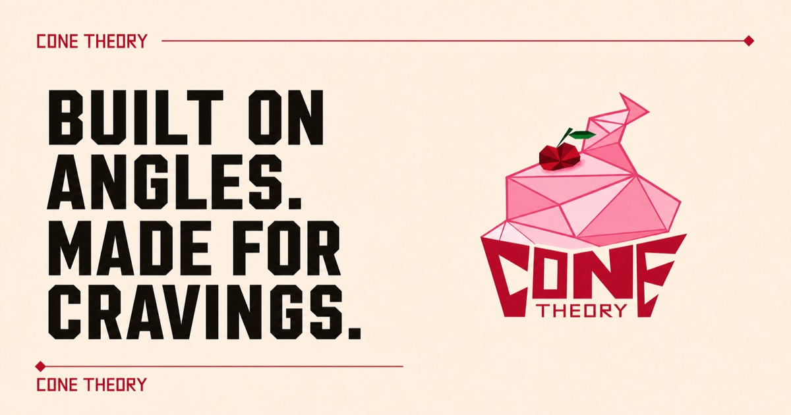
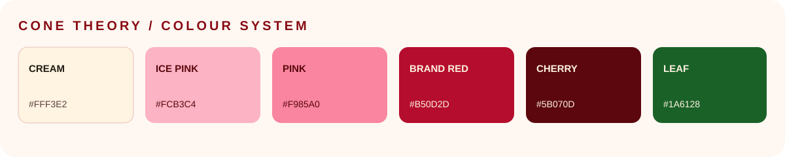

  

  <strong>Built on angles. Made for cravings.</strong> 
  A design-led, motion-rich landing page for a bold small-batch ice-cream concept.

  
  
  

  
  

  

## The project

Cone Theory is a collaborative design-to-production project built around a
geometric ice-cream identity. The experience combines angular brand artwork,
editorial typography, product photography, clipped surfaces, and purposeful
motion in a responsive single-page website.

The production site opens with a three-second logo-and-tagline splash, moves
through the scoop menu and current flavour lineup, explains the small-batch
method, and closes with a clear follow-the-brand call to action.

The application is a statically exported Next.js site. It has no database,
required environment variables, or external runtime media service.

> [!IMPORTANT]
> Cone Theory began with **Daniel Dencil’s original concept and complete
> design system**. Daniel created the full UI/UX, visual identity, logo,
> wordmark, original brand assets, colour palette, layout language, and art
> direction. **Joshua JJ Wonder** translated that design into the complete
> responsive production website, including the code, interaction system,
> accessibility, testing, repository workflow, and Vercel deployment.

## The collaborators

<table>
  <tr>
    <td align="center" width="50%">
      
       
      <strong>Daniel Dencil</strong>
       
      <strong>Concept creator · UI/UX designer · visual identity</strong>
        
      Originated Cone Theory and authored its complete design direction:
      experience architecture, interface layouts, brand artwork, assets,
      typography direction, colour system, and geometric visual language.
        
      <a href="https://www.linkedin.com/in/daniel-dencil/">LinkedIn ↗</a>
      ·
      <a href="https://www.figma.com/design/xnv5wiOto4odb8jiQ2Trtv/Untitled?node-id=0-1&p=f&m=draw">Figma ↗</a>
    </td>
    <td align="center" width="50%">
      
       
      <strong>Joshua JJ Wonder</strong>
       
      <strong>Full-stack web developer · production implementation</strong>
        
      Brought Daniel’s design to life as a responsive, accessible website:
      Next.js architecture, component implementation, motion and interaction,
      content integration, quality assurance, CI, GitHub, and Vercel delivery.
        
      <a href="https://github.com/Triplejw">GitHub ↗</a>
      ·
      <a href="https://cone-theory-live.vercel.app/">Live build ↗</a>
    </td>
  </tr>
</table>

Daniel is expected to join the repository as a collaborator. This README
records the project as shared creative and technical work from the outset;
the design credit is part of the project history and should remain intact.

### Contribution map

| Area | Creative lead | Production lead |
| --- | --- | --- |
| Original concept and brand premise | Daniel Dencil | — |
| UI/UX and page composition | Daniel Dencil | Joshua JJ Wonder implemented it responsively |
| Logo, wordmark, original assets, and palette | Daniel Dencil | Joshua integrated and optimized them for the web |
| Motion and interaction behavior | Daniel set the visual direction | Joshua engineered the browser behavior |
| Responsive frontend and accessibility | Design intent by Daniel | Joshua JJ Wonder |
| Testing, GitHub workflow, and deployment | — | Joshua JJ Wonder |

## Design-to-code approach

The implementation treats the Figma design as the product’s visual source of
truth. Development decisions preserve Daniel’s angular composition and brand
hierarchy while adapting the experience to real browser constraints:

- Daniel’s original artwork and wordmark remain brand assets rather than substitutes.
- Desktop composition collapses deliberately for tablet and mobile layouts.
- Clipped corners retain their structural borders at every breakpoint.
- Motion reinforces the geometry without obscuring navigation or content.
- Touch, keyboard, reduced-motion, and narrow-screen behavior receive explicit
  treatment.
- The static build keeps the final experience fast, portable, and simple to
  deploy.

## Experience highlights

- Three-second, once-per-session logo splash with the canonical brand line
- Immediate **Enter site** action and manual splash replay
- Enlarged, centered header lockup with balanced navigation
- Pointer-responsive hero artwork and animated geometric details
- Continuous, mathematically seamless brand ticker
- Scoop menu and flavour photography inside clipped polygon panels
- Cherry-red content surfaces with accessible cream contrast
- Scroll-progress indicator and scroll-driven section reveals
- Mobile flavour-card snapping and touch-aware interaction states
- Self-hosted typography and original Cone Theory wordmark artwork
- Open Graph and Twitter metadata with a 1200 × 630 sharing card
- Fully static, Vercel-compatible production output

## Page map

| Section | Purpose |
| --- | --- |
| Brand splash | Introduces the logo and “Built on angles. Made for cravings.” for three seconds |
| Hero | Establishes the positioning and primary menu action |
| Scoop scale | Presents serving sizes and pricing |
| Flavours | Shows the current flavour hypotheses with licensed photography |
| Our method | Explains Cone Theory’s sourcing and small-batch principles |
| Find us | Points toward upcoming drops and serving locations |
| Footer | Closes with navigation, replay, copyright, and attribution |

## Visual system

The visual identity—including the palette, logo language, brand assets, and
core UI direction—is Daniel Dencil’s design work. Production tokens are defined
in [`app/globals.css`](./app/globals.css).

  

### Colour palette

| Token | Value | Production role |
| --- | --- | --- |
| `--cream` | `#FFF3E2` | Primary page and splash background |
| `--cream-soft` | `#FFF8F2` | Soft neutral surface |
| `--ice-100` | `#FCB3C4` | Secondary ice-cream pink |
| `--ice-300` | `#F985A0` | Strong pink accent |
| `--brand-red` | `#B50D2D` | Actions, cards, sections, and brand emphasis |
| `--cherry-mid` | `#880A13` | Borders and structural details |
| `--cherry-dark` | `#5B070D` | Deep interaction colour |
| `--ink` | `#201B11` | Primary text and dark surfaces |
| `--muted` | `#5B4040` | Supporting copy |
| `--leaf` | `#1A6128` | Botanical accent |

### Typography

Fonts are self-hosted through `next/font/local`:

| Typeface | Use |
| --- | --- |
| League Spartan | Display headlines and large brand statements |
| Montserrat | Body copy and supporting text |
| Barlow Condensed | Navigation, labels, prices, buttons, and annotations |

Daniel’s original Cone Theory wordmark is used as artwork instead of being
reconstructed with a substitute font.

### Shape and motion

Clipped polygons, angular borders, outlined type, technical labels, and offset
cards carry the brand language into the browser. Motion uses CSS animations,
scroll-linked animation support, and lightweight `requestAnimationFrame`
interactions instead of a large animation dependency.

## Technology

  
  
  
  
  
  

- Next.js App Router with static export
- React and TypeScript
- Handcrafted global CSS and design tokens
- `next/image` with static-export-compatible unoptimized output
- Self-hosted fonts with `next/font/local`
- ESLint with React, Hooks, accessibility, TypeScript, and Next.js rules
- Node’s built-in test runner
- GitHub Actions production verification
- Vercel Git integration and production hosting

## Project structure

~~~text
.
├── .github/workflows/
│   └── production-verification.yml
├── app/
│   ├── fonts/                         # Self-hosted font files
│   ├── globals.css                    # Tokens, layout, motion, responsive rules
│   ├── layout.tsx                     # Fonts, icons, and social metadata
│   └── page.tsx                       # Content and client-side interactions
├── docs/assets/
│   ├── brand-palette.svg              # README palette visual
│   └── collaborators/
│       ├── daniel-dencil.jpg          # UI/UX designer portrait
│       └── joshua-jj-wonder.jpg       # Developer portrait
├── public/
│   ├── cone-theory-logo.png           # Daniel’s geometric brand artwork
│   ├── cone-theory-wordmark.png       # Daniel’s Cone Theory wordmark
│   ├── flavour-*.jpg                  # Licensed flavour photography
│   └── og-v2.jpg                      # Active 1200 × 630 sharing image
├── tests/
│   └── rendered-html.test.mjs         # Source and build smoke checks
├── ASSET_LICENSES.md
├── next.config.ts
├── package.json
├── pnpm-lock.yaml
└── tsconfig.json
~~~

## Local development

### Requirements

- Node.js 22.13.0 or newer
- pnpm 11.16.0

The expected package-manager version is recorded in `package.json`.

### Install and run

~~~bash
corepack enable
pnpm install
pnpm dev
~~~

Open [http://localhost:3000](http://localhost:3000). No `.env` file is
required.

### Commands

| Command | Purpose |
| --- | --- |
| `pnpm dev` | Start the Next.js development server |
| `pnpm build` | Create the static production export in `out/` |
| `pnpm lint` | Run the repository ESLint rules |
| `pnpm test` | Build the site and run the Node smoke test |
| `pnpm start` | Conventional Next.js server command; exported previews should serve `out/` instead |

To preview the exact static output locally:

~~~bash
pnpm build
pnpm dlx serve out
~~~

## Brand-splash behavior

The entrance treatment uses Daniel’s original `public/cone-theory-logo.png`
artwork with the line **Built on angles. Made for cravings.**

1. It opens on the first page load in a browser session.
2. **Enter site** closes it immediately.
3. It closes automatically after three seconds.
4. Completion is stored in `sessionStorage` for the current session.
5. Later navigation in that session skips the automatic splash.
6. Visitors can replay it from the header, hero, call to action, or footer.
7. Reduced-motion visitors bypass the automatic splash.

The splash uses no video, audio, external service, or additional runtime
dependency.

## Accessibility and responsive behavior

- Semantic header, navigation, main content, sections, and footer
- Keyboard-accessible skip link and visible focus indicators
- Descriptive image alternative text and labels for icon-only controls
- Real buttons for actions and links for navigation
- Immediate manual splash exit and cleanup-safe timed dismissal
- Explicit `prefers-reduced-motion` handling
- Touch-aware interaction states and mobile scroll snapping
- Responsive layouts without intentional page-level horizontal overflow

Keyboard navigation, assistive technology, and browser accessibility tools
should be rechecked after substantial design changes.

## Assets, authorship, and licenses

- Cone Theory’s concept, UI/UX, original brand artwork, wordmark, design assets,
  and colour palette are credited to **Daniel Dencil**.
- The website implementation, interaction engineering, QA, repository setup,
  and deployment are credited to **Joshua JJ Wonder**.
- Contributor portraits were supplied for this repository’s documentation and
  are not licensed for unrelated reuse.
- Flavour photography comes from Wikimedia Commons under its respective
  licenses and remains credited in the website footer.

See [`ASSET_LICENSES.md`](./ASSET_LICENSES.md) for detailed photography sources
and asset-use notes.

No repository-wide open-source software license is currently declared. Do not
assume the Cone Theory identity, Daniel’s design work, or the collaborator
portraits are available for use outside this project.

## Quality gates

Every push to `main` and every pull request runs
[`production-verification.yml`](./.github/workflows/production-verification.yml).
The workflow installs locked dependencies, runs ESLint, creates a production
build, and executes the smoke test.

Run the same checks locally before publishing:

~~~bash
pnpm lint
pnpm test
~~~

Recommended release checks:

- Test splash first-view, skip, three-second completion, and replay paths
- Test keyboard navigation and focus visibility
- Check every internal anchor and responsive breakpoint
- Confirm there is no horizontal page overflow
- Confirm all brand and flavour media load
- Confirm photography credits remain visible
- Scan the browser console for runtime errors
- Inspect Open Graph and Twitter metadata
- Confirm the production alias serves the latest `main` commit

## Production deployment

| Setting | Value |
| --- | --- |
| Live site | [cone-theory-live.vercel.app](https://cone-theory-live.vercel.app/) |
| Source repository | [Triplejw/cone-theory](https://github.com/Triplejw/cone-theory) |
| Production branch | `main` |
| Build command | `pnpm build` |
| Output | Next.js static export |
| Environment variables | None |

GitHub stores and verifies the source; Vercel hosts the production website.
With Vercel’s Git integration, pushes to `main` create production deployments
and attach deployment status to the matching GitHub commit.

The `.vercel` directory is intentionally ignored. Project linkage and
deployment records belong to Vercel rather than source control.

## Shared repository note

This repository represents two connected bodies of work:

1. **Daniel Dencil’s creative authorship** — concept, UI/UX, identity, assets,
   palette, composition, and visual direction.
2. **Joshua JJ Wonder’s production authorship** — implementation, responsive
   behavior, interaction engineering, testing, automation, and deployment.

Future design changes should preserve Daniel’s authorship and visual system.
Future engineering changes should keep the implementation accessible,
responsive, tested, and production-ready.

  <strong>Built on angles. Made for cravings.</strong>

